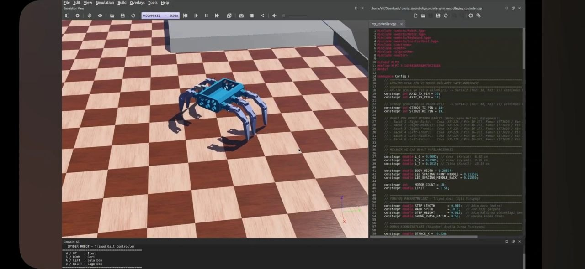

# Hexapod robot

Altı bacaklı, her bacağında üç eklem bulunan yürüyen robot. Toplam 18 servo iki
farklı tipten oluşuyor ve iki ayrı seri hattan sürülüyor. Simülasyonda çalışan
ters kinematik ve yürüyüş kontrolünü gerçek donanıma taşıdık; bu depoda o işin
firmware, kontrolcü ve kalibrasyon araçları var.


## Donanım

| | |
| --- | --- |
| Eklem sayısı | 6 bacak, bacak başına coxa, femur ve tibia |
| Femur servoları | ST3020 (Feetech STS), Serial1 üzerinden 1 Mbaud |
| Coxa ve tibia servoları | AX-12A (Dynamixel), Serial2 üzerinden 1 Mbaud |
| Alt seviye kontrol | Arduino Mega 2560 |
| Kontrolcü | PC üzerinde çalışan C++ programı, Mega ile 115200 baud seri haberleşme |

İki servo tipi farklı protokol konuştuğu için aynı fonksiyonla sürülemiyor. Bu
yüzden Mega iki seri hattı ayrı ayrı yönetip ikisini tek komut arayüzü altında
topluyor.

## Yazılım

**Kontrolcü (`tools/hexapod_controller.cpp`)**
Simülasyonda kurduğumuz yürüyüşün gerçek donanım sürümü. Gövde ve bacak
ölçülerinden ters kinematik çözülüyor, bacaklar iki gruba ayrılıp dönüşümlü
olarak basma ve havada salınım fazları arasında geçiriliyor. Klavyeden ileri,
geri, sağa ve sola komutları veriliyor. Hesaplanan eklem açıları, her motorun
kendi kalibrasyon katsayılarıyla enkoder değerine çevriliyor ve mekanik limitlerin
dışına çıkmaması için sınırlanıyor.

```bash
g++ -std=c++17 -O2 -o hexapod tools/hexapod_controller.cpp
./hexapod /dev/ttyUSB0
```

**Firmware (`src/`)**
PlatformIO projesi. `platformio.ini` içinde her iş için ayrı bir ortam tanımlı,
hangi dosyanın derleneceği `build_src_filter` ile seçiliyor:

| Ortam | Ne yapar |
| --- | --- |
| `mega_full_bridge` | PC kontrolcüsünün kullandığı köprü, iki hattaki 18 motoru sürer |
| `mega_home` | Bütün motorları ölçülmüş merkez konumuna getirir |
| `mega_scan_all` | Her iki hattaki motor kimliklerini tarar |
| `mega_st3020_limitbul` | Motoru iki yöne sürüp mekanik limitleri bulur |
| `mega_eklem_dogrula` | Eklem ile motor kimliği eşleşmesini tek tek oynatarak doğrular |
| `mega_ax12_idtool`, `mega_st3020_idtool` | Servo kimliği atama ve değiştirme araçları |

**Kalibrasyon (`include/motor_calib.h`)**
18 motorun her biri serbest bırakılıp iki uca çevrildi, okunan ham değerlerden
çalışma aralığı ve merkez çıkarıldı. Sayaç sarmasının (ST3020 için 4096, AX-12A
için 1024) üzerine taşan eklemler ayrıca işaretlendi, yoksa alt sınır üst
sınırdan büyük görünüyor.

**Web arayüzü (`tools/motor_ui/`)**
Flask ve Socket.IO ile çalışan küçük bir arayüz. 18 motorun konumunu canlı
gösteriyor, tek tek sürmeye ve tork açıp kapatmaya yarıyor. Kalibrasyon
ölçümlerini bununla aldık.




## Notlar

Motor kimlikleri `include/motor_ids.h` içinde tek yerde tutuluyor. Bacak 1-3 ile
4-6 arasında eklem sırası ters olduğu için dizileri elle sıralamak yerine bu
tablolar kullanılmalı.

Proje bir takım çalışmasıydı. Takım kaptanı olarak yürüttüm, bu depodaki
yazılım bana ait.
